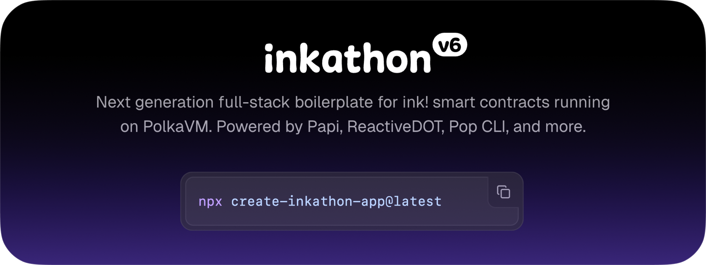

# inkathon v6

[](https://www.gnu.org/licenses/gpl-3.0)
[](https://use.ink)


> Next generation full-stack boilerplate for ink! smart contracts running on PolkaVM. Powered by Papi, ReactiveDOT, Pop CLI, and more.

- 🤖 **Check out the [live demo](https://inkathon.xyz)**
- 📖 **Explore our new [documentation](https://docs.inkathon.xyz)**
- 💬 **Join the discussion on [Telegram](https://t.me/inkathon)**

## Quickstart ⚡

> [!IMPORTANT]
>
> - Setup Node.js v20+ (recommended via [nvm](https://github.com/nvm-sh/nvm))
> - Install [Bun](https://bun.sh/)

Use the new `create-inkathon-app` CLI to set up the boilerplate:

```bash
bunx create-inkathon-app@latest

cd <project-name>

bun run dev
```

Learn more in our new [documentation](https://docs.inkathon.xyz).

## About the project

The inkathon boilerplate is almost as old as ink! itself. With over 200 stars, more than 250 public projects depending on it, and the most active [ink! Telegram group](https://t.me/inkathon).

It offers a complete setup for developing full-stack dApps on Polkadot with ink! smart contracts and Next.js and now shines in new glory with full ink! v6 support. Powered by Papi, ReactiveDOT, Pop CLI, and more.

## New Features in v6

The boilerplate has been completely rebuilt with:

- **Full ink! v6 support** with PolkaVM compatibility
- **Type-safe contract interactions** via PAPI
- **Modern stack**: Bun, Next.js 15, React 19, Tailwind CSS v4
- **Improved DX**: Better build scripts & deployment automation
- **Production-ready**: Docker support, self-hosting optimized
- **New `create-inkathon-app` CLI** for setting up the boilerplate in seconds
- **New [documentation](https://docs.inkathon.xyz)** with educational resources & guides

## Changelog

> [!NOTE]  
> The old ink! v5 compatible boilerplate is available on the [`v1` branch](https://github.com/scio-labs/inkathon/tree/v1).

The v6 changelog is available on the [GitHub releases page](https://github.com/scio-labs/inkathon/releases).
