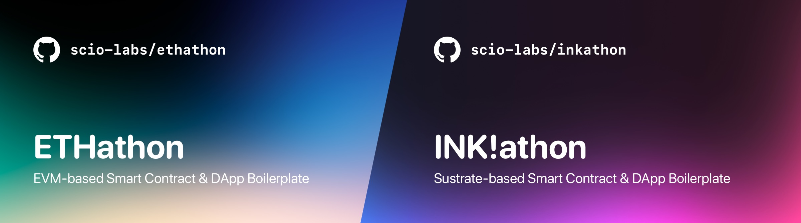

# INK!athon – Substrate-based Smart Contract & DApp Boilerplate




---

This is an opinionated boilerplate/starterkit/scaffold to get up and running with smart contract & dApp development in the substrate-ecosystem.

It also comes in handy for hackathons. 👀

By [Dennis Zoma](https://twitter.com/dennis_zoma) 🧙‍♂️ & [Scio Labs](https://scio.xyz) 💫.

---

**Table of Contents:**

1. [Disclaimer 🚨](#disclaimer-)
2. [The Stack](#the-stack)
3. [Projects using it](#projects-using-it)
4. [Getting Started](#getting-started)
   1. [Frontend](#frontend)
   2. [Contracts](#contracts)
5. [Development](#development)
   1. [Frontend Quickstart](#frontend-quickstart)
   2. [Contracts Quickstart](#contracts-quickstart)
   3. [VSCode Setup](#vscode-setup)
6. [Customization](#customization)
7. [Deployment](#deployment)
8. [FAQs \& Troubleshooting](#faqs--troubleshooting)

---

## Disclaimer 🚨

This repository is still work-in-progress and there are probably bugs. Open tasks include:

- [ ] Typesafe contract interactions with `@polkadot/typegen`
- [ ] Upgrade to WeightsV2 & ink! v4
- [ ] Support contract deployment via CLI that generates abi & address in one single `.json`

## The Stack

- Package-Manager: `pnpm`
- Smart Contract Development: `ink!`, `cargo`
- Frontend: `next`
  - Contract Interactions: `polkadot-js`
  - Styling: `chakra`, `tailwindcss`, `twin.macro`, `emotion`
- Misc:
  - Linting & Formatting: `eslint`, `prettier`, `husky`, `lint-staged`

## Projects using it

Below you find a few projects that use this boilerplate, a variation of it, or have a similar setup setup that inspired it:

- [Azero Domains](https://github.com/wottpal/azero.domains) – Domain Nameservice for Aleph Zero (Hackathon)

## Getting Started

### Frontend

```bash
# 1. Install pnpm (https://pnpm.io/installation)
npm i -g pnpm

# 2. Install dependencies
pnpm install

# 3. Copy & fill environments
# NOTE: Documentation of environment variables can be found in the according `.example` file
# NOTE: Start with only the alephzero-testnet
cp packages/frontend/.env.local.example packages/frontend/.env.local
```

### Contracts

```bash
# 1. Install Rust & Cargo: https://docs.substrate.io/install/
# NOTE: Leave out the "Compile a Substrate node" part for now

# 2. Install ink! CLI tooling (https://use.ink/getting-started/setup#ink-cli)
cargo install cargo-dylint dylint-link
cargo install cargo-contract --force --git https://github.com/paritytech/cargo-contract.git --tag v1.5.0

# 3. Optional: Install local substrate-contracts-node (https://github.com/paritytech/substrate-contracts-node)
# IMPORTANT: The installation is fixed to latest release tag before using WeightsV2
cargo install contracts-node --force --git https://github.com/paritytech/substrate-contracts-node.git --tag v0.21.0
```

## Development

### Frontend Quickstart

```bash
# NOTE: Can be executed in both, the root-dir or in `packages/frontend/`

# Start Frontend (Next.js)
pnpm dev
```

### Contracts Quickstart

I created sorthand npm-scripts for most interactions (e.g. build, or starting a local node). Therefore, to execute those the active terminal directory needs to be `packages/contracts`. The full commands can be found in `packages/contracts/package.json`.

```bash
# Build Contracts
pnpm build

# Start local Substrate node (https://github.com/paritytech/substrate-contracts-node)
pnpm node

# Start local node with persistence & automatically open contracts-ui
# NOTE: When using Brave, shields have to be taken down for the UIs
pnpm dev

# Now deploy the generated `greeter.contract` file via drag'n'drop in contracts-ui
# Copy the deployed contracts address and save it via the following command
ADDRESS=… pnpm write-address

# NOTE: This command can also be adapted for different contracts and chains
ADDRESS=123 CHAIN=alephzero-testnet CONTRACT=new_greeter pnpm write-address

# Test Contracts
pnpm test
```

### VSCode Setup

#### Workspace

I strongly reommend developing in VSCode by opening the workspace file located at `.vscode/inkathon.code-workspace` instead of just the directory. This has multiple advantages and assures a more predictable monorepo configuration. The first plugin listed below will help with getting used to it.

#### Plugins

I strongly recommend installing all plugins listed inside `.vscode/extensions.json`. They should be suggested automatically by VSCode.

<details>
<summary><strong>Plugin Details</strong></summary>

1. [`zoma.vscode-auto-open-workspace`](https://marketplace.visualstudio.com/items?itemName=zoma.vscode-auto-open-workspace) – Automatically suggests opening the according `.code-workspace` file.
2. [`dbaeumer.vscode-eslint`](https://marketplace.visualstudio.com/items?itemName=dbaeumer.vscode-eslint) – Adds ESLint editor support.
3. [`esbenp.prettier-vscode`](https://marketplace.visualstudio.com/items?itemName=esbenp.prettier-vscode) – Adds Prettier editor support.
4. [`bradlc.vscode-tailwindcss`](https://marketplace.visualstudio.com/items?itemName=bradlc.vscode-tailwindcss) & [`lightyen.tailwindcss-intellisense-twin`](https://marketplace.visualstudio.com/items?itemName=lightyen.tailwindcss-intellisense-twin) – Adds tailwindcss & twin.macro editor support.
5. [`bungcip.better-toml`](https://marketplace.visualstudio.com/items?itemName=bungcip.better-toml) – Adds `.toml` file support.
6. [`rust-lang.rust-analyzer`](https://marketplace.visualstudio.com/items?itemName=rust-lang.rust-analyzer) – Adds Rust language support.
7. Optional: [`gruntfuggly.todo-tree`](https://marketplace.visualstudio.com/items?itemName=gruntfuggly.todo-tree) & [`wayou.vscode-todo-highlight`](https://marketplace.visualstudio.com/items?itemName=wayou.vscode-todo-highlight) – Lists all `TODO` comments in your workspace.
8. Optional: [`mikestead.dotenv`](https://marketplace.visualstudio.com/items?itemName=mikestead.dotenv) – Adds syntax highlighting for `.env` files.

</details>

#### Snippets

The file [`packages/frontend/.vscode/frontend.code-snippets`](https://github.com/scio-labs/inkathon/blob/main/packages/frontend/.vscode/frontend.code-snippets) contains useful snippets for quickly creating components & pages with Next.js, React, Typescript, and twin.macro. Example: Enter "Function Component with Props" in an empty `.tsx` file to get a `FC` component boilerplate with an empty TypeScript interface declaration and already imported 'twin.macro'. Check out the snippet-file itself to get a full overview.

## Customization

There are multiple places where you need to insert your actual project name & identifier. I highlighted most of these occurences with a `/* TODO */` comment in the code. When installing the `todo-tree` plugin [listed above](#vscode-setup) you can easily replace them one by one.

Additionally, there are the following un-highlighted occurences:

- The name of the `.vscode/*.code-workspace` file
- The package names within `package.json`, `packages/frontend/package.json`, and `packages/contracts/package.json`
- The workspace dependency defined in `packages/frontend/package.json`

## Deployment

Setting up a deployment via Vercel is pretty straightforward as build settings are preconfigured in `vercel.json`. To get started, press the **Deploy** button and enter the default environment variables listed below.

[](https://vercel.com/new/clone?repository-url=https%3A%2F%2Fgithub.com%2Fscio-labs%2Finkathon%2F&env=NEXT_PUBLIC_PRODUCTION_MODE,NEXT_PUBLIC_URL,NEXT_PUBLIC_DEFAULT_CHAIN,NEXT_PUBLIC_SUPPORTED_CHAINS&envDescription=Environment%20Variables%20Documentation&envLink=https%3A%2F%2Fgithub.com%2Fscio-labs%2Finkathon%2Fblob%2Fmain%2Fpackages%2Ffrontend%2F.env.local.example&demo-url=https%3A%2F%2Finkathon.xyz)

| Environment Variable          | Value                          |
| ----------------------------- | ------------------------------ |
| `NEXT_PUBLIC_PRODUCTION_MODE` | `true`                         |
| `NEXT_PUBLIC_URL`             | `https://your-repo.vercel.app` |
| `NEXT_PUBLIC_DEFAULT_CHAIN`   | `alephzero-testnet`            |
| `NEXT_PUBLIC_DEFAULT_CHAIN`   | `["alephzero-testnet"]`        |

You can find mode documentation on those environment variables in [`packages/frontend/.env.local.example`](https://github.com/scio-labs/inkathon/blob/main/packages/frontend/.env.local.example) and all available blockchain network identifiers in [`packages/frontend/src/deployments/chains.ts`](https://github.com/scio-labs/inkathon/blob/main/packages/frontend/src/deployments/chains.ts).

## FAQs & Troubleshooting

<details>
<summary><strong>What is pnpm and do I really need it?</strong></summary>

[Pnpm](https://pnpm.io/) works in my experience way faster and more reliable within monorepos than npm or yarn. When using it though, it's strongly recommended everyone in the team uses it. No installs should perform be performed nor any other lockfiles should be commited.

Also, esp. the `contracts` package has multiple shorthand npm scripts defined in its `package.json` that are recommended to use.

</details>

<details>
<summary><strong>How to approach styling?</strong></summary>

This boilerplate currently offers styling via the following options.

- [Chakra UI](https://chakra-ui.com/) – Component library for quick prototyping e.g. during hackathons)
- [twin.macro](https://github.com/ben-rogerson/twin.macro) – [Tailwindcss](https://tailwindcss.com/) within Styled Components via [Emotion](https://emotion.sh/docs/styled) (see [snippets](#snippets))
- Standard (S)CSS styles via `className` and `*.module.(s)css` files.

Important, in production it's recommended to use at most one of 1. and 2. to reduce bundle size.

</details>

<details>
<summary><strong>Can I just use plain TailwindCSS?</strong></summary>

The packages above can be easily switched out with plain TailwindCSS, a detailed guide on that is coming very soon. In the meantime, open an issue to get guidance.

</details>

<details>
<summary><strong>Resources to learn more about Substrate, ink!, and polkadot.js</strong></summary>

- [Polkadot Bulder's Guide](https://wiki.polkadot.network/docs/build-index)
- [Substrate Documentation](https://docs.substrate.io/)
- [Awesome Substrate](https://github.com/substrate-developer-hub/awesome-substrate)
- [ink! Documentation](https://use.ink/)
- [OpenBrush Documentation](https://docs.openbrush.io/)
- [polkadot.js Documentation](https://polkadot.js.org/docs/)

</details>
