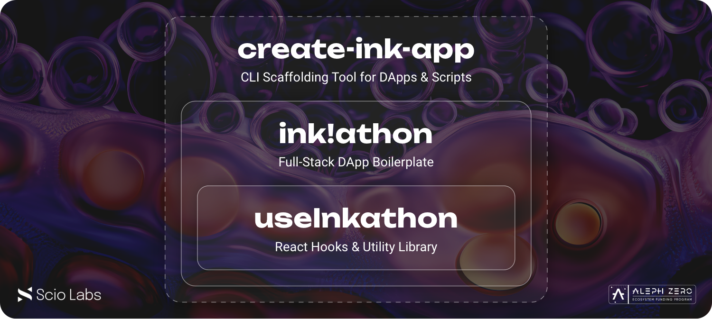

# ink!athon Boilerplate

[](https://www.gnu.org/licenses/gpl-3.0)
[](https://use.ink)


This is a full-stack dApp boilerplate for ink! smart contracts with an integrated frontend. It can be used to quickly start developing your hackathon idea or to scaffold a production-ready Web3 application.

The project is part of a [Scio Labs](https://scio.xyz) initiative to improve the developer experience in the ink! ecosystem and a proud member of the [Aleph Zero EFP](https://alephzero.org/ecosystem-funding-program). 💜

Other projects include:

- `create-ink-app` CLI (_Coming soon_)
- [`ink!athon`](https://github.com/scio-labs/inkathon) Boilerplate
- [`useInkathon`](https://github.com/scio-labs/use-inkathon) Hooks & Utility Library
- [`zink!`](https://github.com/scio-labs/zink) Smart Contract Macros

**Join the discussion in our [Telegram Group](https://t.me/inkathon)** 💬

**If you want to contribute, please read our [Contributor Guidelines](https://github.com/scio-labs/inkathon/blob/main/CONTRIBUTING.md)** 🙏

---

**Table of Contents:**

1. [About 📖](#about-)
2. [Getting started 🚀](#getting-started-)
   1. [1. Run the frontend](#1-run-the-frontend)
   2. [2. Build \& deploy contracts on a local node](#2-build--deploy-contracts-on-a-local-node)
   3. [3. Connect the frontend to the local node](#3-connect-the-frontend-to-the-local-node)
3. [Customization 🎨](#customization-)
   1. [1. Project Name](#1-project-name)
   2. [2. Custom Contracts](#2-custom-contracts)
   3. [3. Custom Scripts](#3-custom-scripts)
4. [The Stack 🥞](#the-stack-)
5. [Live Examples 🌐](#live-examples-)
6. [Deployment 🚢](#deployment-)
   1. [Environment Variables](#environment-variables)
   2. [Contract Deployment](#contract-deployment)
7. [VSCode Setup 🛠](#vscode-setup-)
   1. [Workspace](#workspace)
   2. [Plugins](#plugins)
8. [FAQs \& Troubleshooting 💬](#faqs--troubleshooting-)

---

## About 📖

The boilerplate comes with a small sample ink! `Greeter` contract which stores a `message` (the "greeting") and allows anyone to update it. The frontend contains simple UI components to connect your wallet and interact with the contract (i.e. read & write the `message`). Try it out live on [inkathon.xyz](https://inkathon.xyz).

## Getting started 🚀

### 1. Run the frontend

The frontend works out of the box, without a local node running, as the sample contract is pre-deployed on certain live testnets (i.e. `alephzero-testnet` and `shibuya`). Necessary deployment metadata and addresses are provided under `contracts/deployments/`.

> **Pre-requisites:**
>
> - Setup Node.js v18+ (recommended via [nvm](https://github.com/nvm-sh/nvm) with `nvm install 18`)
> - Install [pnpm](https://pnpm.io/installation) (recommended via [Node.js Corepack](https://nodejs.org/api/corepack.html) or `npm i -g pnpm`)
> - Clone this repository

<details>
<summary><strong>Special Instructions for Windows Users</strong></summary>

> [!IMPORTANT]  
> Windows users must either use [WSL](https://learn.microsoft.com/windows/wsl/install) (recommended) or a custom shell like [Git Bash](https://git-scm.com/downloads). PowerShell is not supported.

> **Pre-requisites when using WSL for Linux:**
>
> - Install [WSL](https://learn.microsoft.com/windows/wsl/install) and execute _all_ commands in the WSL terminal
> - Setup Node.js v18+ (recommended via [nvm](https://github.com/nvm-sh/nvm) with `nvm install 18`)
> - Install the following npm packages globally:
> - `npm i -g npm`
> - `npm i -g pnpm node-gyp make`
> - Clone this repository into the WSL file system (e.g. `/home/<user>/inkathon`).
>
> **Tip:** You can enter `\\wsl$\` in the top bar of the Windows Explorer to access the WSL file system visually.

</details>

```bash
# Install dependencies (once)
# NOTE: This automatically creates an `.env.local` file
pnpm install

# Start Next.js frontend
pnpm run dev
```

Optionally, to enable [`simple-git-hooks`](https://github.com/toplenboren/simple-git-hooks) (for automatic linting & formatting when committing), you can run the following command once: `pnpm simple-git-hooks`.

### 2. Build & deploy contracts on a local node

The `contracts/package.json` file contains shorthand scripts for building, testing, and deploying your contracts. To run these scripts, you need to set `contracts/` as the active working directory in your terminal.

> **Pre-requisites:**
>
> - Install Rust via the [Substrate Docs](https://docs.substrate.io/install/) (skip the "Compile a Substrate node" section)
> - Install [`cargo contract`](https://github.com/paritytech/cargo-contract)
> - Install [`substrate-contracts-node`](https://github.com/paritytech/substrate-contracts-node)

```bash
# Build contracts and move artifacts to `contracts/deployments/{contract}/` folders
pnpm run build

# Start local node with persistence (contracts stay deployed after restart)
# NOTE: When using Brave, shields have to be taken down for the UIs
pnpm run node

## IMPORTANT: Open a separate terminal window and keep the node running

# Deploy the contracts on the local node
pnpm run deploy
```

Alternatively, you can also deploy contracts manually using [Contracts UI](https://contracts-ui.substrate.io/) (`pnpm contracts-ui`) in the browser.

### 3. Connect the frontend to the local node

Open the `frontend/.env.local` file and set the `NEXT_PUBLIC_DEFAULT_CHAIN` variable to `development`. Then restart the frontend and you should be able to interact with the contracts deployed on your local node.

_Read more about environment variables and all available chain constants in the [Environment Variables](#environment-variables) section below._

## Customization 🎨

### 1. Project Name

There are multiple places where you need to insert your project's name and identifier. Most of these occurrences are highlighted with a `/* TODO */` comment in the code. You can easily replace them one by one by installing the [`todo-tree`](https://marketplace.visualstudio.com/items?itemName=gruntfuggly.todo-tree) plugin.

Additionally, there are the following un-highlighted occurrences:

- the name of the `inkathon.code-workspace` file
- the `package.json`'s name & metadata in the root directory as well as in the `contracts/` and `frontend/` packages
- the workspace dependency (`@inkathon/contracts`) defined in `frontend/package.json` and imported in `frontend/src/deployments/deployments.ts`

### 2. Custom Contracts

To replace the default `Greeter` contract or add a new one, you need to do the following:

- Add a new contract directory under `contracts/src/`
- Add it as another workspace member to the `contracts/Cargo.toml` file
- Add another deployment script or adjust `contracts/scripts/deploy.ts`
- Adjust the `ContractIds` enum and `getDeployments` function in `frontend/src/deployments/deployments.ts`

### 3. Custom Scripts

Adding custom scripts is useful to interact with your contracts or test certain functionality. Therefore, just duplicate & reuse the `contracts/scripts/script.template.ts` file and run it via `pnpm run script <script-name>`. This command will run the TypeScript file directly via [`tsx`](https://github.com/privatenumber/tsx).

For general scripts, the same environment variable initialization & configuration applies as described below in the [Deployment](#deployment) section (e.g. to change the target network).

## The Stack 🥞

<details>
<summary><strong>The Stack in Detail</strong></summary>

- Monorepo Workspace with `contracts/` and `frontend/` directories as packages.
- Package Manager: `pnpm` or `yarn@stable` (Read more in the [FAQs](#faqs--troubleshooting) section below)
- Smart Contract Development: Rust, ink!, `cargo-contract`, `substrate-contracts-node`
- Frontend: Next.js (app-dir), React, TypeScript
  - Contract Interactions: `polkadot-js`, [`useInkathon`](https://github.com/scio-labs/use-inkathon) React Hooks & Utility Library (alternatively: [`useInk`](https://use.ink/frontend/getting-started))
  - Styling: `shadcn/ui`, `tailwindcss`
  - Linting & Formatting: `eslint`, `prettier`, `simple-git-hooks`, `lint-staged`
- Type-safe contract generation via [`typechain-polkadot`](https://github.com/Brushfam/typechain-polkadot)

<small>Styling, linting, and formatting libraries can be fully dropped or replaced with alternatives.</small>

</details>


## Live Examples 🌐

Below you find live examples that use this boilerplate or have a similar setup inspired by it:

- [inkathon.xyz](https://inkathon.xyz) – Live demo deployment of this boilerplate
- [AZERO.ID](https://azero.id) – Domain Name Service for Aleph Zero and beyond
- Multiple hackathon projects from [ETHWarsaw](https://ethwarsaw-2023.devpost.com/submissions/), [HackOnChain](https://www.hackonchain.xyz/), [ETHDam](https://www.ethdam.com/), and the [Polkadot ink! Hackathon](https://www.encode.club/polkadot-ink-hackathon).

## Deployment 🚢

Spinning up a deployment via Vercel is pretty straightforward as the necessary settings are already configured in `vercel.json`. If you haven't cloned the repository yet, you can also use the **Deploy** button below to create a new repository from this template.

[](https://vercel.com/new/clone?repository-url=https%3A%2F%2Fgithub.com%2Fvercel%2Fnext.js%2Ftree%2Fcanary%2Fexamples%2Fhello-world&env=NEXT_PUBLIC_DEFAULT_CHAIN&envDescription=Insert%20%60alephzero-testnet%60%20or%20%60shibuya%60&envLink=https%3A%2F%2Fgithub.com%2Fscio-labs%2Finkathon%23environment-variables&project-name=inkathon&repository-name=inkathon&redirect-url=https%3A%2F%2Fgithub.com%2Fscio-labs%2Finkathon&demo-url=https%3A%2F%2Finkathon.xyz)

Alternatively, you can also use the provided Dockerfiles to deploy to any hosting provider of your choice. Read more [here](https://github.com/scio-labs/inkathon/pull/50#issue-2041934251).

### Environment Variables

All environment variables are imported from `process.env` in [`frontend/src/config/environment.ts`](https://github.com/scio-labs/inkathon/blob/main/frontend/src/config/environment.ts) and re-exported from there. For improved type safety, Always only import environment variables from `@/config/environment` and never directly from `process.env`.

| Environment Variables           | [Default Values](https://github.com/scio-labs/inkathon/blob/main/frontend/.env.local.example) | Description                                                                                                                                                         |
| ------------------------------- | --------------------------------------------------------------------------------------------- | ------------------------------------------------------------------------------------------------------------------------------------------------------------------- |
| `NEXT_PUBLIC_DEFAULT_CHAIN` \*️⃣ | ️`alephzero-testnet`                                                                          | The network (Substrate-based chain) the frontend should connect to by default and what contract deployment artifacts to import.                                     |
| `NEXT_PUBLIC_PRODUCTION_MODE`   | `false`                                                                                       | Optional boolean flag to differentiate production environment (e.g. for SEO or Analytics).                                                                          |
| `NEXT_PUBLIC_URL`               | `http://localhost:3000`                                                                       | Optional string that defines the base URL of the frontend (will be auto-inferred from Vercel environment variables).                                                |
| `NEXT_PUBLIC_SUPPORTED_CHAINS`  | –                                                                                             | Optional array with network identifers (e.g. `["alephzero-testnet", "shibuya"]`) that are supported by the frontend, **if the dApp is supposed to be multi-chain**. |

<small>\*️⃣ Required </small>

#### Supported Chains

One key element making this boilerplate so flexible is the usage of environment variables to configure the active network in the frontend. This is done by setting the `NEXT_PUBLIC_DEFAULT_CHAIN` variable in the `frontend/.env.local` file, or in the deployment settings respectively.

If your network is not provided by the `use-inkathon` library, you can add it manually by creating a new [`SubstrateChain`](https://github.com/scio-labs/use-inkathon/blob/main/src/chains.ts#L4) object. If you think a chain is missing, please open an issue or PR.

> [!IMPORTANT]  
> All supported chain constants [can be found here](https://github.com/scio-labs/use-inkathon/blob/main/src/chains.ts) in the `scio-labs/use-inkathon` repository.

### Contract Deployment

In the [Getting Started](#getting-started) section above, we've already deployed the sample `Greeter` contract on a local node. To target a live network, we can use the `CHAIN` environment variable when running the `deploy` script.

```bash
CHAIN=alephzero-testnet pnpm run deploy
```

Further, dynamically loaded environment files with the `.env.{chain}` naming convention can be used to add additional configuration about the deployer account.

```bash
# .env.alephzero-testnet
ACCOUNT_URI=bottom drive obey lake curtain smoke basket hold race lonely fit walk//Alice
```

When running the same script again, this deployer account defined there will be used to sign the extrinsic.

> [!WARNING]  
> These files are gitignored by default, but you should still be extra cautious when adding sensitive information to them.

## VSCode Setup 🛠

### Workspace

It can be helpful to develop in VSCode by opening the workspace file `inkathon.code-workspace` instead of just the plain directory. This approach offers multiple advantages, like sections in the file explorer, or shortcut actions to open the terminal in the correct directory.

Consider installin the [`zoma.vscode-auto-open-workspace`](https://marketplace.visualstudio.com/items?itemName=zoma.vscode-auto-open-workspace) extension to automatically open the workspace file when opening the directory.

### Plugins

Additionally, the VSCode plugins listed below are recommended as they can be very helpful when working with this boilerplate.

<details>
<summary><strong>All Recommended Plugins</strong></summary>

| Plugin Name                                                                                                      | Description                                   |
| ---------------------------------------------------------------------------------------------------------------- | --------------------------------------------- |
| [`dbaeumer.vscode-eslint`](https://marketplace.visualstudio.com/items?itemName=dbaeumer.vscode-eslint)           | Adds ESLint editor support.                   |
| [`esbenp.prettier-vscode`](https://marketplace.visualstudio.com/items?itemName=esbenp.prettier-vscode)           | Adds Prettier editor support.                 |
| [`bradlc.vscode-tailwindcss`](https://marketplace.visualstudio.com/items?itemName=bradlc.vscode-tailwindcss)     | Adds tailwindcss editor support.              |
| [`rust-lang.rust-analyzer`](https://marketplace.visualstudio.com/items?itemName=rust-lang.rust-analyzer)         | Adds Rust language support.                   |
| [`ink-analyzer.ink-analyzer`](https://marketplace.visualstudio.com/items?itemName=ink-analyzer.ink-analyzer)     | Adds ink! language support.                   |
| [`tamasfe.even-better-toml`](https://marketplace.visualstudio.com/items?itemName=tamasfe.even-better-toml)       | Adds `.toml` file support.                    |
| [`gruntfuggly.todo-tree`](https://marketplace.visualstudio.com/items?itemName=gruntfuggly.todo-tree)             | Lists all `TODO` comments in your workspace.  |
| [`wayou.vscode-todo-highlight`](https://marketplace.visualstudio.com/items?itemName=wayou.vscode-todo-highlight) | Highlights `TODO` comments in your workspace. |
| [`mikestead.dotenv`](https://marketplace.visualstudio.com/items?itemName=mikestead.dotenv)                       | Adds syntax highlighting for `.env` files.    |

</details>

## FAQs & Troubleshooting 💬

<details>
<summary><strong>Which package managers are supported? Do I have to use pnpm?</strong></summary>

For monorepo workspaces, [pnpm](https://pnpm.io) is likely the fastest and most reliable choice. When using it though, it's strongly recommended everyone on the team uses it. No installs should be performed nor any other lock files should be committed.

As an alternative, [yarn](https://yarnpkg.com/) is also supported and can be used for installation. Caveats when using yarn:

- Only the stable version of yarn (currently v3) is supported, not [yarn classic](https://classic.yarnpkg.com/) (v1).
- `yarn.lock` files should be committed instead of `.pnpm-lock.yaml` files.
- The `pnpm` CLI is still used in many `package.json` scripts, so these would have to be adjusted manually.

> [!IMPORTANT]  
> As [npm](https://www.npmjs.com/) lacks support for the `workspace` import protocol, it's not compatible with ink!athon.

</details>

<details>
<summary><strong>How to solve `Cannot find module './greeter/development.ts'`?</strong></summary>

Sometimes, Next.js doesn't pick up changes (i.e. file creations) in the `contracts/deployments/{contract}/` folders correctly. E.g., when you just deployed on a local node for the first time and set the frontend's `.env.local` to connect to the `development` network.

To fix this, you can delete the build cache at `frontend/.next`. This is currently the only solution and will force Next.js to rebuild the project and pick up the new files.

> [!NOTE]  
> To prevent this behavior, the `contracts/package.json` file contains a small `postinstall` script that creates an empty `development.ts` file if none exists.

</details>

<details>
<summary><strong>How to approach styling?</strong></summary>

Currently it offers styling via the following options out of the box:

- [shadcn/ui](https://ui.shadcn.com/) - Re-usable components built using [Radix UI](https://radix-ui.com/) and [Tailwind CSS](https://tailwindcss.com/).
- Vanilla [Tailwind CSS](https://tailwindcss.com/) styled styles via `className` and `*.module.(s)css` files.
- Default (S)CSS styles.

> [!INFO]  
> This boilerplate tries to stay as un-opinonated in regards to styling, which means you can use any styling or component library.

</details>

<details>
<summary><strong>How do type-safe contract interactions work?</strong></summary>

With [`typechain-polkadot`](https://github.com/Brushfam/typechain-polkadot), types for each contract (TypeScript files) are created upon build (via the `build` script or `build-all.sh` command). You can suppress this behavior by passing `--skip-types`.

They are stored under `contracts/typed-contracts/` and imported directly from the frontend. Then, via the new `useRegisteredTypedContract` hook from [`useInkathon`](https://github.com/scio-labs/use-inkathon) instances with pre-defined api, network-dependant contract address, and injected signer are being created. See `greeter-contract-interactions.tsx` for an example.

</details>

<details>
<summary><strong>Resources to learn more about Substrate, ink!, and polkadot.js</strong></summary>

- [ink! Documentation](https://use.ink/)
- [polkadot.js Documentation](https://polkadot.js.org/docs/)
- [Polkadot Wiki ink! Tools](https://wiki.polkadot.network/docs/build-open-source)
- [Aleph Zero Documentation](https://docs.alephzero.org/aleph-zero/build/)
- [ink!athon Workshop Recording](https://youtube.com/watch?v=DA1pLk5--GE)
- [ink!athon Telegram Group](https://t.me/inkathon)

</details>
