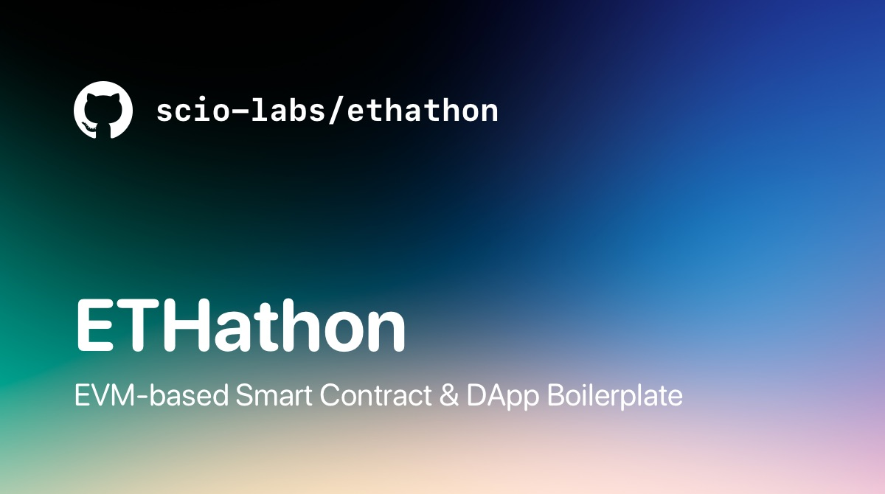
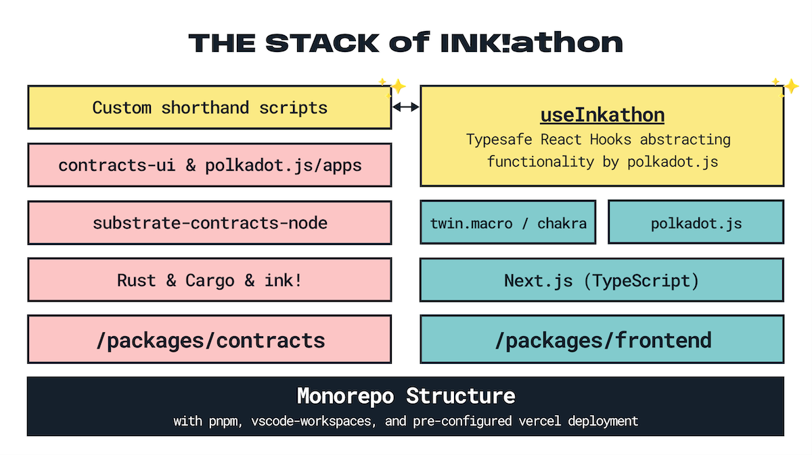

# ink!athon – DApp Boilerplate for Substrate & ink!


[](https://scio.xyz)



---

This is an opinionated boilerplate to get up and running with dApp development in the Substrate ecosystem, especially with ink! smart contracts. It uses custom-built [`useInkathon` React Hooks](https://github.com/scio-labs/use-inkathon) that abstract & improve the polkadot.js experience.

By [Dennis Zoma](https://zoma.dev) & [Scio Labs](https://scio.xyz) 🪄

Join our [Telegram Group](https://t.me/inkathon) 💬

---

**Table of Contents:**

1. [Disclaimer 🚨](#disclaimer-)
2. [The Stack](#the-stack)
3. [Projects using it](#projects-using-it)
4. [Getting Started](#getting-started)
   1. [Frontend](#frontend)
   2. [Contracts](#contracts)
5. [Development](#development)
   1. [Frontend Quickstart](#frontend-quickstart)
   2. [Contracts Quickstart](#contracts-quickstart)
   3. [VSCode Setup](#vscode-setup)
6. [Customization](#customization)
7. [Deployment](#deployment)
8. [FAQs \& Troubleshooting](#faqs--troubleshooting)

---

## Disclaimer 🚨

This repository is still work-in-progress and there are probably bugs. See the [open issues](https://github.com/scio-labs/inkathon/issues).

## The Stack



<details>
<summary><strong>The Stack in Detail</strong></summary>

- Structure: Monorepo
- Package-Manager: `pnpm`
- Smart Contract Development: `ink!`, `rust`, `cargo`, `cargo-contract`, `contracts-node`
- Frontend: `next`, `react`, `typescript`
  - Contract Interactions: `polkadot-js`, [`useInkathon` React Hooks](https://github.com/scio-labs/use-inkathon)
  - Styling: `chakra`, `tailwindcss`, `twin.macro`, `emotion`
- Misc:
  - Linting & Formatting: `eslint`, `prettier`, `husky`, `lint-staged`
- Deployment: Vercel

</details>

## Projects using it

Below you find a few projects that use this boilerplate, a variation of it, or have a similar setup that inspired it:

- [AZERO.ID](https://azero.id) – Domain Name Service for Aleph Zero and beyond
- Multiple hackathon projects from [EthWarsaw](https://ethwarsaw-2023.devpost.com/submissions/) and [HackOnChain](https://www.hackonchain.xyz/)

## Prerequisites

### Frontend

```bash
# 1. Setup Node.js (recommended via nvm)

# 2. Install pnpm: https://pnpm.io/installation (recommended via node corepack)

# 3. Install dependencies
pnpm install

# 4. Copy & fill environments
# NOTE: Documentation of environment variables can be found in the `.example` files
# NOTE: For simplicity, start with only the `alephzero-testnet` enabled
cp packages/frontend/.env.local.example packages/frontend/.env.local
```

### Contracts

```bash
# 1. Setup Rust: https://docs.substrate.io/install/
# NOTE: Skip the "Compile a Substrate node" section

# 2. Install ink! cli (cargo contract): https://github.com/paritytech/cargo-contract

# 3. Install local contracts node: https://github.com/paritytech/substrate-contracts-node
```

## Development

### Frontend Quickstart

The frontend should work out of the box as remote deployments (address & abi) for `alephzero-testnet` and `shibuya` are provided within the repo already.

```bash
# Start Frontend (Next.js)
# NOTE: Can be executed in both, the root-dir or in `packages/frontend/`
pnpm dev
```

If you want to run it against a local deployment on a locally running Substrate node, make sure to set the defined `NEXT_PUBLIC_DEFAULT_CHAIN` in `packages/frontend/.env.local` to `development`. Then follow the startup and deployment process described in the section below.

### Contracts Quickstart

I created convenience scripts for most interactions (i.e. build & deploy). To run those the active terminal directory needs to be `packages/contracts`. The full command list can be found in `packages/contracts/package.json`.

```bash
# Build Contracts & move deployments to `./deployments/{contract}/` folders
# NOTE: When adding/renaming your contracts, edit them in `build-all.sh`
pnpm build

# Test Contracts
# NOTE: When adding/renaming your contracts, edit them in `test-all.sh`
pnpm test

# Start local node with persistence (contracts stay deployed after restart)
# NOTE: When using Brave, shields have to be taken down for the UIs
pnpm node

# Deploy Contracts (on the local node)
# NOTE: Prerequisites fo all scripts are Node, pnpm, and `pnpm install`
pnpm run deploy

# Deploy Contracts (on any other chain)
# NOTE: Make sure to create a `.{chain}.env` environment file (gitignored)
#       with the `ACCOUNT_URI` you want to use.
#       Also, chain must be a network-id from here: https://github.com/scio-labs/use-inkathon/blob/main/src/chains.ts.
CHAIN=alephzero-testnet pnpm run deploy

# Run any other script from the `./scripts` directory
pnpm ts-node scripts/{script}.ts
```

You can also upload & instantiate contracts manually using [Contracts UI](https://contracts-ui.substrate.io/) (`pnpm contracts-ui`).

### VSCode Setup

#### Workspace

I strongly recommend developing in VSCode by opening the workspace file located at `.vscode/inkathon.code-workspace` instead of just the directory. This has multiple advantages and assures a more predictable monorepo configuration. The first plugin listed below will help with getting used to it.

#### Plugins

I strongly recommend installing all plugins listed inside `.vscode/extensions.json`. They should be suggested automatically by VSCode.

<details>
<summary><strong>Plugin Details</strong></summary>

1. [`zoma.vscode-auto-open-workspace`](https://marketplace.visualstudio.com/items?itemName=zoma.vscode-auto-open-workspace) – Automatically suggests opening the according `.code-workspace` file.
2. [`dbaeumer.vscode-eslint`](https://marketplace.visualstudio.com/items?itemName=dbaeumer.vscode-eslint) – Adds ESLint editor support.
3. [`esbenp.prettier-vscode`](https://marketplace.visualstudio.com/items?itemName=esbenp.prettier-vscode) – Adds Prettier editor support.
4. [`bradlc.vscode-tailwindcss`](https://marketplace.visualstudio.com/items?itemName=bradlc.vscode-tailwindcss) & [`lightyen.tailwindcss-intellisense-twin`](https://marketplace.visualstudio.com/items?itemName=lightyen.tailwindcss-intellisense-twin) – Adds tailwindcss & twin.macro editor support.
5. [`tamasfe.even-better-toml`](https://marketplace.visualstudio.com/items?itemName=tamasfe.even-better-toml) – Adds `.toml` file support.
6. [`rust-lang.rust-analyzer`](https://marketplace.visualstudio.com/items?itemName=rust-lang.rust-analyzer) – Adds Rust language support.
7. Optional: [`gruntfuggly.todo-tree`](https://marketplace.visualstudio.com/items?itemName=gruntfuggly.todo-tree) & [`wayou.vscode-todo-highlight`](https://marketplace.visualstudio.com/items?itemName=wayou.vscode-todo-highlight) – Lists all `TODO` comments in your workspace.
8. Optional: [`mikestead.dotenv`](https://marketplace.visualstudio.com/items?itemName=mikestead.dotenv) – Adds syntax highlighting for `.env` files.

</details>

#### Snippets

The file [`packages/frontend/.vscode/frontend.code-snippets`](https://github.com/scio-labs/inkathon/blob/main/packages/frontend/.vscode/frontend.code-snippets) contains useful snippets for quickly creating components & pages with Next.js, React, Typescript, and twin.macro. Example: Enter "Function Component with Props" in an empty `.tsx` file to get a `FC` component boilerplate with an empty TypeScript interface declaration and already imported 'twin.macro'. Check out the snippet-file itself to get a full overview.

## Customization

There are multiple places where you need to insert your actual project name & identifier. I highlighted most of these occurrences with a `/* TODO */` comment in the code. When installing the `todo-tree` plugin [listed above](#vscode-setup) you can easily replace them one by one.

Additionally, there are the following un-highlighted occurrences:

- The name of the `.vscode/*.code-workspace` file
- The package names within `package.json`, `packages/frontend/package.json`, and `packages/contracts/package.json`
- The workspace dependency defined in `packages/frontend/package.json`

## Deployment

Setting up a deployment via Vercel is pretty straightforward as build settings are preconfigured in `vercel.json`. To get started, press the **Deploy** button and enter the default environment variables listed below.

[](https://vercel.com/new/clone?repository-url=https%3A%2F%2Fgithub.com%2Fscio-labs%2Finkathon%2F&env=NEXT_PUBLIC_DEFAULT_CHAIN&envDescription=Environment%20Variables%20Documentation&envLink=https%3A%2F%2Fgithub.com%2Fscio-labs%2Finkathon%2Fblob%2Fmain%2Fpackages%2Ffrontend%2F.env.local.example&demo-url=https%3A%2F%2Finkathon.xyz)

### Environment Variables

The only mandatory environment variable you need to add is `NEXT_PUBLIC_DEFAULT_CHAIN`. Just set it to `alephzero-testnet` at least for the first deploy, as there is the sample contract deployed & the [deplyoments](https://github.com/scio-labs/inkathon/blob/main/packages/frontend/src/deployments/deployments.ts) are pre-configured.

Please see all pre-defined environment variables below and find more info in [`packages/frontend/.env.local.example`](https://github.com/scio-labs/inkathon/blob/main/packages/frontend/.env.local.example). All available blockchain network identifiers are defined in the [`useInkathon` repository](https://github.com/scio-labs/use-inkathon/blob/main/src/chains.ts).

| Environment Variable           | Value                          |
| ------------------------------ | ------------------------------ |
| `NEXT_PUBLIC_PRODUCTION_MODE`  | `true`                         |
| `NEXT_PUBLIC_URL`              | `https://your-repo.vercel.app` |
| `NEXT_PUBLIC_DEFAULT_CHAIN`    | `alephzero-testnet`            |
| `NEXT_PUBLIC_SUPPORTED_CHAINS` | `["alephzero-testnet"]`        |

### Contract Deployment

Please see the [Contract Quickstart](#contracts-quickstart) section above.

## FAQs & Troubleshooting

<details>
<summary><strong>What is pnpm and do I need it?</strong></summary>

[Pnpm](https://pnpm.io/) works in my experience way faster and more reliably within monorepos than npm or yarn. When using it though, it's strongly recommended everyone on the team uses it. No installs should perform be performed nor any other lock files should be committed.

Also, esp. the `contracts` package has multiple shorthand npm scripts defined in its `package.json` that are recommended to use.

</details>

<details>
<summary><strong>How to approach styling?</strong></summary>

This boilerplate currently offers styling via the following options.

- [Chakra UI](https://chakra-ui.com/) – Component library for quick prototyping e.g. during hackathons)
- [twin.macro](https://github.com/ben-rogerson/twin.macro) – [Tailwindcss](https://tailwindcss.com/) within Styled Components via [Emotion](https://emotion.sh/docs/styled) (see [snippets](#snippets))
- Standard (S)CSS styles via `className` and `*.module.(s)css` files.

Important, in production it's recommended to use at most one of 1. and 2. to reduce bundle size.

</details>

<details>
<summary><strong>Can I just use plain TailwindCSS?</strong></summary>

The packages above can be easily switched out with plain TailwindCSS, a detailed guide that is coming soon. In the meantime, open an issue to get guidance.

</details>

<details>
<summary><strong>Resources to learn more about Substrate, ink!, and polkadot.js</strong></summary>

- [Polkadot Builder's Guide](https://wiki.polkadot.network/docs/build-index)
- [Substrate Documentation](https://docs.substrate.io/)
- [Awesome Substrate](https://github.com/substrate-developer-hub/awesome-substrate)
- [ink! Documentation](https://use.ink/)
- [OpenBrush Documentation](https://docs.openbrush.io/)
- [polkadot.js Documentation](https://polkadot.js.org/docs/)

</details>
